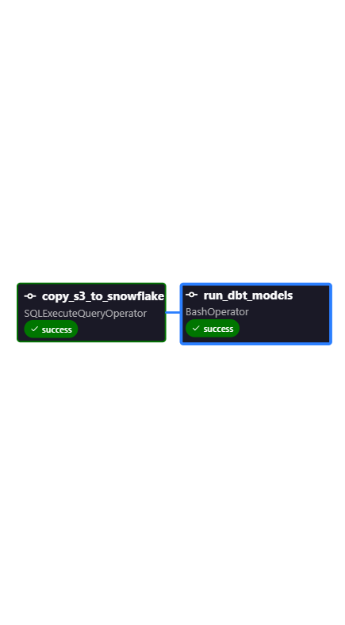

# ❄️ Zomato End-to-End Modern Data Stack Pipeline

**Tech Stack:** `AWS S3` | `Snowflake` | `dbt Core` | `Tableau Desktop`

---

An enterprise-grade analytical data pipeline engineered to ingest semi-structured JSON restaurant source data from AWS S3 into Snowflake, model scalable dimensional marts using dbt Core, and infer dynamic business intelligence insights via Tableau.

Project Objective:

This project reinforces the core Modern Data Stack (MDS) engineering principles. It mimics a real-world production environment by transforming raw, multi-format source data into production-ready business intelligence assets.


Tech Stack:
1. Storage: AWS S3
2. Data Warehouse: Snowflake
3. Transformation: dbt (Data Build Tool)
4. BI Visualization: Tableau (Link: Coming Soon)


Data Architecture & Pipeline:
1. Ingestion: Semi-structured JSON datasets uploaded to AWS S3
   Link: Zomato Kaggle data (https://www.kaggle.com/datasets/shrutimehta/zomato-restaurants-data)
2. Staging: Copied data into raw Snowflake ingestion tables

    ## ❄️ Storage Integration & Data Ingestion (Snowflake)

    Data ingestion is designed with security and production best practices in mind, utilizing an identity-based AWS IAM Role integration model via a `STORAGE_INTEGRATION` object instead of exposing static AWS Access Keys.

    ### Raw Data Stage Validation
    The multi-format JSON records are staged via an external S3 pointer. Running a storage inventory check confirms immediate read accessibility over the raw file chunks:

    ```sql
    LIST @zomato_db.raw.s3_stage;
    ```

    

    ### Semi-Structured Data Ingestion (`VARIANT`)
    Raw payloads landing from the S3 data lake are loaded directly into target staging tables using Snowflake's native `VARIANT` data type. This isolates ingestion from schema drift and preserves the full JSON structure for downstream transformations:

    ```sql
    SELECT * FROM staging_orders LIMIT 17;
    ```

    

    ### Semi-Structured Data Parsing (`LATERAL FLATTEN`)
    To prepare the nested data layers for analytical modeling, a relational view is built by leveraging Snowflake’s native JSON path dot-notation and relational flattening mechanisms to unnest the restaurant payload arrays into strongly typed fields:

    ```sql
    SELECT 
        f.value:restaurant:id::INT as restaurant_id,
        f.value:restaurant:name::STRING as restaurant_name,
        f.value:restaurant:location:city::STRING as city
    FROM zomato_db.raw.staging_orders,
    LATERAL FLATTEN(input => raw_json:restaurants) f;
    ```

    

3. Modeling: Structural formatting applied via Snowflake staging views

   
    ## ⚙️ Pipeline Orchestration (Apache Airflow)

    The end-to-end data pipeline is fully automated and orchestrated using **Apache Airflow** running locally inside Docker containers via the **Astro CLI** on a WSL2 Ubuntu distribution.

    ### Pipeline Execution Graph
    

    ### Workflow Steps:
    1. **`copy_s3_to_snowflake`**: Extracted semi-structured raw JSON restaurant datasets from AWS S3 and loaded them directly into Snowflake ingestion tables using the `SQLExecuteQueryOperator`.
    2. **`run_dbt_models`**: Fired a `BashOperator` to execute downstream dbt transformation models, building optimized production-ready Fact and Dimension tables for analysis.


4. Transformation: dbt models built on top of staged views to generate optimized Dimension and Fact tables
5. Analytics: A scoped data extract built to feed a functional Tableau dashboard


Repository Structure:
snowflake/

dbt/
models/marts/

src/
data_ingestion/

tableau/


Analytics and Business Intelligence (BI) Layer:
The presentation layer consists of a Zomato Global Analytics dashboard powered by data extracts from Dimension and Fact tables. It focuses on Global Culinary trends.


Key Visualizations & Features:
1. Global Restaurant Map: Interactive geographic map plotting restaurant locality density and distributions globally.
2. Global Cuisine Leaderboard: Ranked bar chart analyzing cuisines by their Average Customer Ratings and Average Price for Two people.
3. Dynamic Data Filters: Integrated interactive filtering for localized analysis:
     Country Name multi-select filter (e.g., India, Australia, Brazil, Canada).
     Cuisine Name multi-select filter.
     Quantitative sliders tracking Average Cost For Two and Average Total Votes.


Core Business Metrics Surfaced:
Average Cost For Two (Pricing tier analysis)
Average Customer Rating (Cuisine performance indicator)
Total Votes (Customer engagement and popularity tracking)

